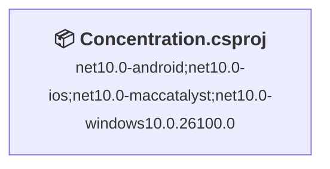
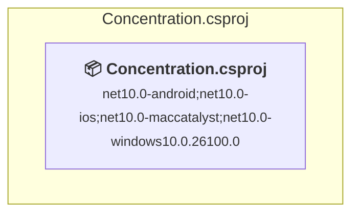

# Projects and dependencies analysis

This document provides a comprehensive overview of the projects and their dependencies in the context of upgrading to .NETCoreApp,Version=v11.0.

## Table of Contents

- [Executive Summary](#executive-Summary)
  - [Highlevel Metrics](#highlevel-metrics)
  - [Projects Compatibility](#projects-compatibility)
  - [Package Compatibility](#package-compatibility)
  - [API Compatibility](#api-compatibility)
- [Aggregate NuGet packages details](#aggregate-nuget-packages-details)
- [Top API Migration Challenges](#top-api-migration-challenges)
  - [Technologies and Features](#technologies-and-features)
  - [Most Frequent API Issues](#most-frequent-api-issues)
- [Projects Relationship Graph](#projects-relationship-graph)
- [Project Details](#project-details)

  - [Concentration\Concentration.csproj](#concentrationconcentrationcsproj)

## Executive Summary

### Highlevel Metrics

| Metric | Count | Status |
| :--- | :---: | :--- |
| Total Projects | 1 | All require upgrade |
| Total NuGet Packages | 8 | 1 need upgrade |
| Total Code Files | 27 |  |
| Total Code Files with Incidents | 21 |  |
| Total Lines of Code | 975 |  |
| Total Number of Issues | 279 |  |
| Estimated LOC to modify | 277+ | at least 28.4% of codebase |

### Projects Compatibility

| Project | Target Framework | Difficulty | Package Issues | API Issues | Est. LOC Impact | Description |
| :--- | :---: | :---: | :---: | :---: | :---: | :--- |
| [Concentration\Concentration.csproj](#concentrationconcentrationcsproj) | net10.0-android;net10.0-ios;net10.0-maccatalyst;net10.0-windows10.0.26100.0 | 🟢 Low | 1 | 277 | 277+ | ClassLibrary, Sdk Style = True |

### Package Compatibility

| Status | Count | Percentage |
| :--- | :---: | :---: |
| ✅ Compatible | 7 | 87.5% |
| ⚠️ Incompatible | 1 | 12.5% |
| 🔄 Upgrade Recommended | 0 | 0.0% |
| ***Total NuGet Packages*** | ***8*** | ***100%*** |

### API Compatibility

| Category | Count | Impact |
| :--- | :---: | :--- |
| 🔴 Binary Incompatible | 3 | High - Require code changes |
| 🟡 Source Incompatible | 272 | Medium - Needs re-compilation and potential conflicting API error fixing |
| 🔵 Behavioral change | 2 | Low - Behavioral changes that may require testing at runtime |
| ✅ Compatible | 1457 |  |
| ***Total APIs Analyzed*** | ***1734*** |  |

## Aggregate NuGet packages details

| Package | Current Version | Suggested Version | Projects | Description |
| :--- | :---: | :---: | :--- | :--- |
| CommunityToolkit.Mvvm | 8.4.2 |  | [Concentration.csproj](#concentrationconcentrationcsproj) | ✅Compatible |
| Microsoft.Extensions.Logging.Debug | 10.0.7 |  | [Concentration.csproj](#concentrationconcentrationcsproj) | ✅Compatible |
| Microsoft.Maui.Controls | 10.0.60 |  | [Concentration.csproj](#concentrationconcentrationcsproj) | ✅Compatible |
| Microsoft.Maui.Controls.Compatibility | 10.0.60 |  | [Concentration.csproj](#concentrationconcentrationcsproj) | ✅Compatible |
| Mopups | 1.3.4 |  | [Concentration.csproj](#concentrationconcentrationcsproj) | ✅Compatible |
| Plugin.Maui.Audio | 4.0.0 |  | [Concentration.csproj](#concentrationconcentrationcsproj) | ✅Compatible |
| sqlite-net-pcl | 1.9.172 |  | [Concentration.csproj](#concentrationconcentrationcsproj) | ✅Compatible |
| Xamarin.AndroidX.Core.SplashScreen | 1.2.0.2 |  | [Concentration.csproj](#concentrationconcentrationcsproj) | ⚠️NuGet package is incompatible |

## Top API Migration Challenges

### Technologies and Features

| Technology | Issues | Percentage | Migration Path |
| :--- | :---: | :---: | :--- |

### Most Frequent API Issues

| API | Count | Percentage | Category |
| :--- | :---: | :---: | :--- |
| T:Microsoft.Maui.Controls.Image | 79 | 28.5% | Source Incompatible |
| T:Microsoft.Maui.Controls.ImageSource | 31 | 11.2% | Source Incompatible |
| P:Microsoft.Maui.Controls.Image.Source | 31 | 11.2% | Source Incompatible |
| T:Microsoft.Maui.Controls.BindingMode | 20 | 7.2% | Source Incompatible |
| T:Microsoft.Maui.Controls.NameScopeExtensions | 19 | 6.9% | Source Incompatible |
| M:Microsoft.Maui.Controls.NameScopeExtensions.FindByName''1(Microsoft.Maui.Controls.Element,System.String) | 19 | 6.9% | Source Incompatible |
| T:Microsoft.Maui.Controls.Xaml.Extensions | 7 | 2.5% | Source Incompatible |
| T:Microsoft.Maui.Hosting.MauiApp | 5 | 1.8% | Source Incompatible |
| M:Microsoft.Maui.Controls.ResourceDictionary.#ctor | 4 | 1.4% | Source Incompatible |
| M:Microsoft.Maui.Controls.ContentPage.#ctor | 4 | 1.4% | Source Incompatible |
| T:Microsoft.Maui.Hosting.MauiAppBuilder | 4 | 1.4% | Source Incompatible |
| F:Microsoft.Maui.Controls.BindingMode.TwoWay | 3 | 1.1% | Source Incompatible |
| F:Microsoft.Maui.Controls.BindingMode.OneWayToSource | 3 | 1.1% | Source Incompatible |
| M:Microsoft.Maui.Controls.Page.OnAppearing | 3 | 1.1% | Source Incompatible |
| T:Microsoft.Maui.Controls.Shell | 3 | 1.1% | Source Incompatible |
| T:Microsoft.Maui.Controls.ResourceDictionary | 2 | 0.7% | Source Incompatible |
| F:Microsoft.Maui.Controls.BindingMode.Default | 2 | 0.7% | Source Incompatible |
| P:Microsoft.Maui.Controls.BindableProperty.DefaultBindingMode | 2 | 0.7% | Source Incompatible |
| T:Microsoft.Maui.Controls.IValueConverter | 2 | 0.7% | Source Incompatible |
| T:Microsoft.Maui.Controls.ContentPage | 2 | 0.7% | Source Incompatible |
| M:Microsoft.Maui.MauiWinUIApplication.#ctor | 2 | 0.7% | Binary Incompatible |
| M:Microsoft.Maui.Controls.Shell.#ctor | 2 | 0.7% | Source Incompatible |
| T:Microsoft.Maui.Hosting.FontCollectionExtensions | 2 | 0.7% | Source Incompatible |
| T:Microsoft.Maui.Hosting.IFontCollection | 2 | 0.7% | Source Incompatible |
| M:Microsoft.Maui.Hosting.FontCollectionExtensions.AddFont(Microsoft.Maui.Hosting.IFontCollection,System.String,System.String) | 2 | 0.7% | Source Incompatible |
| T:Microsoft.Maui.Controls.Window | 2 | 0.7% | Source Incompatible |
| M:Microsoft.Maui.Controls.Application.#ctor | 2 | 0.7% | Source Incompatible |
| T:Microsoft.Maui.Controls.BindableProperty | 1 | 0.4% | Source Incompatible |
| P:Microsoft.Maui.Controls.Shell.Current | 1 | 0.4% | Source Incompatible |
| M:Microsoft.Maui.Controls.Shell.GoToAsync(Microsoft.Maui.Controls.ShellNavigationState) | 1 | 0.4% | Source Incompatible |
| T:Microsoft.Maui.Storage.FileSystem | 1 | 0.4% | Source Incompatible |
| M:Microsoft.Maui.Storage.FileSystem.OpenAppPackageFileAsync(System.String) | 1 | 0.4% | Source Incompatible |
| T:System.Uri | 1 | 0.4% | Behavioral Change |
| M:System.Uri.#ctor(System.String) | 1 | 0.4% | Behavioral Change |
| T:Microsoft.Maui.MauiWinUIApplication | 1 | 0.4% | Binary Incompatible |
| M:Microsoft.Maui.Hosting.MauiAppBuilder.Build | 1 | 0.4% | Source Incompatible |
| P:Microsoft.Maui.Hosting.MauiAppBuilder.Logging | 1 | 0.4% | Source Incompatible |
| T:Microsoft.Maui.Controls.Hosting.AppHostBuilderExtensions | 1 | 0.4% | Source Incompatible |
| M:Microsoft.Maui.Controls.Hosting.AppHostBuilderExtensions.UseMauiApp''1(Microsoft.Maui.Hosting.MauiAppBuilder) | 1 | 0.4% | Source Incompatible |
| T:Microsoft.Maui.Hosting.FontsMauiAppBuilderExtensions | 1 | 0.4% | Source Incompatible |
| M:Microsoft.Maui.Hosting.FontsMauiAppBuilderExtensions.ConfigureFonts(Microsoft.Maui.Hosting.MauiAppBuilder,System.Action{Microsoft.Maui.Hosting.IFontCollection}) | 1 | 0.4% | Source Incompatible |
| M:Microsoft.Maui.Hosting.MauiApp.CreateBuilder(System.Boolean) | 1 | 0.4% | Source Incompatible |
| T:Microsoft.Maui.IActivationState | 1 | 0.4% | Source Incompatible |
| M:Microsoft.Maui.Controls.Window.#ctor(Microsoft.Maui.Controls.Page) | 1 | 0.4% | Source Incompatible |
| T:Microsoft.Maui.Controls.Application | 1 | 0.4% | Source Incompatible |

## Projects Relationship Graph

Legend:
📦 SDK-style project
⚙️ Classic project

## Project Details

### Concentration\Concentration.csproj

#### Project Info

- **Current Target Framework:** net10.0-android;net10.0-ios;net10.0-maccatalyst;net10.0-windows10.0.26100.0
- **Proposed Target Framework:** net10.0-android;net10.0-ios;net10.0-maccatalyst;net10.0-windows10.0.26100.0;net11.0-windows
- **SDK-style**: True
- **Project Kind:** ClassLibrary
- **Dependencies**: 0
- **Dependants**: 0
- **Number of Files**: 27
- **Number of Files with Incidents**: 21
- **Lines of Code**: 975
- **Estimated LOC to modify**: 277+ (at least 28.4% of the project)

#### Dependency Graph

Legend:
📦 SDK-style project
⚙️ Classic project

### API Compatibility

| Category | Count | Impact |
| :--- | :---: | :--- |
| 🔴 Binary Incompatible | 3 | High - Require code changes |
| 🟡 Source Incompatible | 272 | Medium - Needs re-compilation and potential conflicting API error fixing |
| 🔵 Behavioral change | 2 | Low - Behavioral changes that may require testing at runtime |
| ✅ Compatible | 1457 |  |
| ***Total APIs Analyzed*** | ***1734*** |  |

